## Unit testing in Python - Why we want to make it a habit

#### Sections

Advantages of unit testing  
Main components a typical unit test  
The different unit test frameworks in Python  
Installing py.test)  
A py.test example walkthrough  
     Writing some code we want to test  
     Creating a "test" file  
     Testing edge cases and refining our code  

* * *

  

## Advantages of unit testing

Traditionally, for every piece of code we write (let it be a single function
or class method), we would feed it some arbitrary inputs to make sure that it
works the way we have expected. And this might sound like a reasonable
approach given that everything works as it should and if we do not plan to
make any changes to the code until the end of days. Of course, this is rarely
the case.  
Suppose we want to modify our code by refactoring it, or by tweaking it for
improved efficiency: Do we really want to manually type the previous test
cases all over again to make sure we didn't break anything? Or suppose we are
planning to pass our code along to our co-workers: What reason do they have to
trust it? How can we make their life easier by providing evidence that
everything was tested and is supposed to work properly?  
Surely, no one wants to spend hours or even days of mundane work to test code
that was inherited before it can be put to use in good conscience.  
There must be a cleverer way, an automated and more systematic approach…  
This is where unit tests come into play. Once we designed the interface
(_here:_ the in- and outputs of our functions and methods), we can write down
several test cases and let them be checked every time we make changes to our
code - without the tedious work of typing everything all over again, and
without the risk of forgetting anything or by omitting crucial tests simply
due to laziness.  
**This is especially important in scientific research, where your whole project depends on the correct analysis and assessment of any data - and there is probably no more convenient way to convince both you and the rightly skeptical reviewer that you just made a(nother) groundbreaking discovery.**

  
  

## Main components a typical unit test

In principle, unit testing is really no more than a more systematic way to
automate code testing process. Where the term "unit" is typically defined as
an isolated test case that consists of a the following components:  
  
\- a so-called "fixture" (e.g., a function, a class or class method, or even a
data file)  
\- an action on the fixture (e.g., calling a function with a particular input)  
\- an expected outcome (e.g., the expected return value of a function)  
\- the actual outcome (e.g., the actual return value of a function call)  
\- a verification message (e.g., a report whether the actual return value
matches the expected return value or not)

  
  

## The different unit test frameworks in Python

In Python, we have the luxury to be able to choose from a variety of good and
capable unit testing frameworks. Probably, the most popular and most widely
used ones are:  
  
\- the [unittest](http://docs.python.org/3.3/library/unittest.html) module -
part of the Python Standard Library  
\- [nose](https://nose.readthedocs.org/en/latest/index.html)  
\- [py.test](http://pytest.org/latest/index.html)  
  
All of them work very well, and they are all sufficient for basic unit
testing. Some people might prefer to use _nose_ over the more "basic"
_unittest_ module. And many people are moving to the more recent _py.test_
framework, since it offers some nice extensions and even more advanced and
useful features. However, it shall not be the focus of this tutorial to
discuss all the details of the different unit testing frameworks and weight
them against each other. The screenshot below shows how the simple execution
of _py.test_ and _nose_ may look like. To provide you with a little bit more
background information: Both _nose_ and _py.test_ are crawling a subdirectory
tree while looking for Python script files that start with the naming prefix
"test". If those script files contain functions, classes, and class methods
that also start with the prefix "test", the contained code will be executed by
the unit testing frameworks.  
  
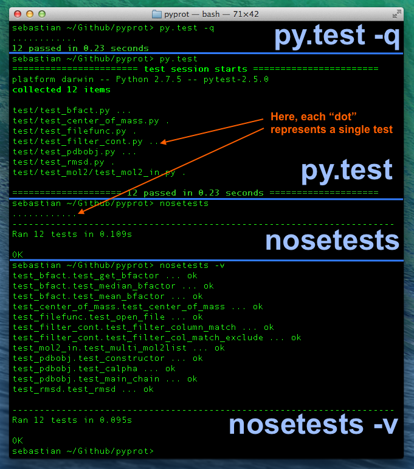

  

* * *

Command line syntax:  
`py.test <file/directory>` \- default unit testing with detailed report  
`py.test -q <file/directory>` \- default unit testing with summarized report
(quiet mode)  
`nosetests` \- default unit testing with summarized report  
`nosetests -v` \- default unit testing with detailed report (verbose mode)  

* * *

  

For the further sections of this tutorial, we will be using _py.test_, but
everything is also compatible to the _nose_ framework, and for the simple
examples below it would not matter which framework we picked.  
However, there is one little difference in the default behavior, though, and
it might also answer the question: "How does the framework know where to find
the test code to execute?"  
By default, _py.test_ descends into all subdirectories (from the current
working directory or a particular folder that you provided as additional
argument) looking for Python scripts that start with the prefix "test". If
there are functions, classes, or class methods contained in these scripts that
also start with the prefix "test", those will be executed by the unit testing
framework. The basic behavior of _nose_ is quite similar, but in contrast to
browsing through all subdirectories, it will only consider those that start
with the prefix "test" to look for the respective Python unit test code. Thus,
it is a good habit to put all your test code under a directory starting with
the prefix "test" even if you use _py.test_ \- your _nose_ colleagues will
thank you!  
The figure below shows how the _nose_ and _py.test_ unit test frameworks would
descend the subdirectory tree looking for Python script files that start with
the prefix "test".  
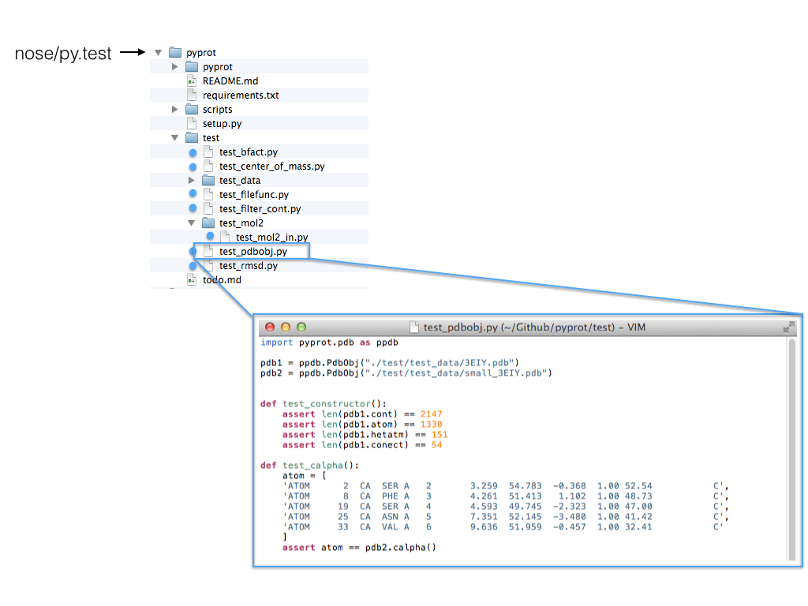

_Note: Interestingly,_ nose _seems to be twice as fast as_ py.test _in the
example above, and I was curious if it is due to the fact that_ py.test
_searches all subdirectories (_ nose _only searches those that start with
"test"). Although there is a tiny speed difference when I specify the test
code containing folder directly,_ nose _still seems to be faster. However, I
don't know how it scales, and it might be an interesting experiment to test
for much larger projects._  
  
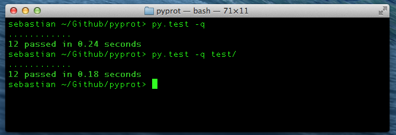

  
  

## Installing py.test

Installing py.test is pretty straightforward. We can install it directly from
the command line via  

    
    
    pip install -U pytest 
    

  
or  

    
    
    easy_install -U pytest
    

  
If this doesn't work for you, you can visit the _py.test_ website
(<http://pytest.org/latest/>), download the package, and try to install it
"manually":  

    
    
    ~/Desktop/pytest-2.5.0> python3 setup.py install
    

  
If it was installed correctly, we can now run _py.test_ in any directory from
the command line via  

    
    
    py.test <file or directory> 
    

  
or  

    
    
    python -m pytest <file or directory>
    

  

  
  

## A py.test example walkthrough

For the following example we will be using _py.test_, however, _nose_ works
pretty similarly, and as I mentioned in the previous section, I only want to
focus on the essentials of unit testing here. Note that _py.test_ has a lot of
advanced and useful features to offer that we won't touch in this tutorial,
e.g., setting break points for debugging, etc. (if you want to learn more,
please take a look at the complete _py.test_ documentation:
<http://pytest.org/latest/contents.html#toc>).

  

### Writing some code we want to test

Assume we wrote two very simple functions that we want to test, either as
small scripts or part of a larger package. The first function,
"multiple_of_three", is supposed to check whether a number is a multiple of
the number 3 or not. We want the function to return the boolean value True if
this is the case, and else it should return False. The second function,
"filter_multiples_of_three", takes a list as input argument and is supposed to
return a subset of the input list containing only those numbers that are
multiples of 3.  
  
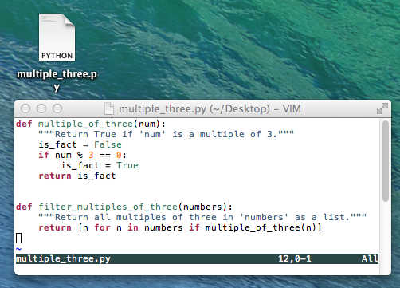

  

### Creating a "test" file

Next, we write a small unit test to check if our function works for some
simple input cases:  
  
  
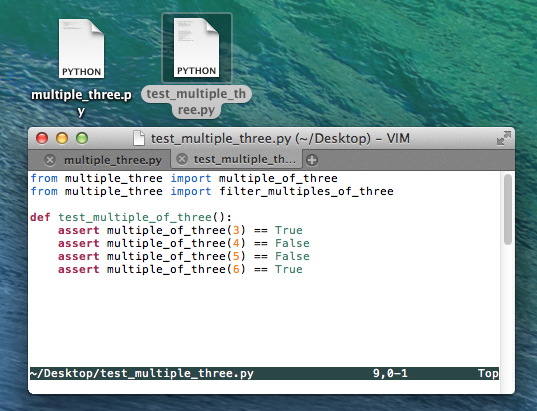  
  
Great, when we run our py.test unit testing framework, we see that everything
works as expected!  
  
  
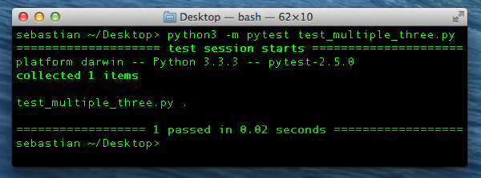  
  
But what about edge cases?

  
  

### Testing edge cases and refining our code

In order to check if our function is yet robust enough to handle special
cases, e.g., 0 as input, we extend our unit test code. Here, assume that we
don't want 0 to evaluate to True, since we don't consider 3 to be a factor of
0.  
  
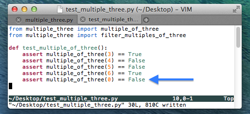
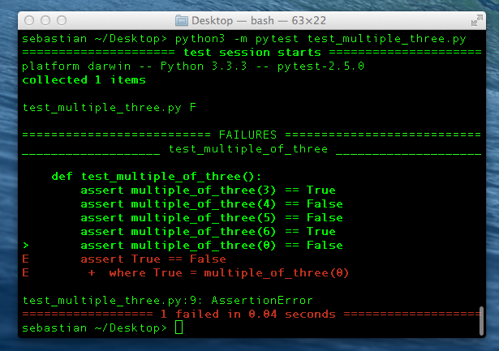  
  
As we can see from the _py.test report_, our test just failed. So let us go
back and fix our code to handle this special case.  
  
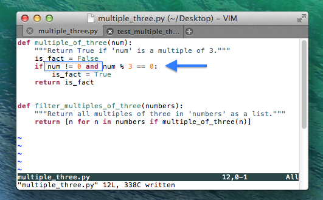  
  
So far so good, when we execute _py.test_ again (image not shown) we see that
our codes handles 0 correctly now. Let us add some more edge cases: Negative
integers, decimal floating-point numbers, and large integers.

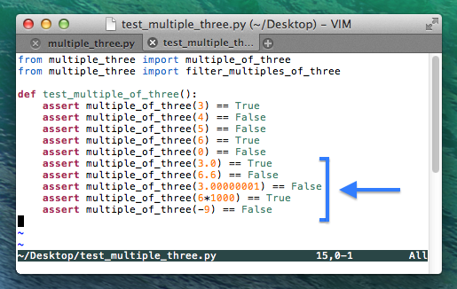
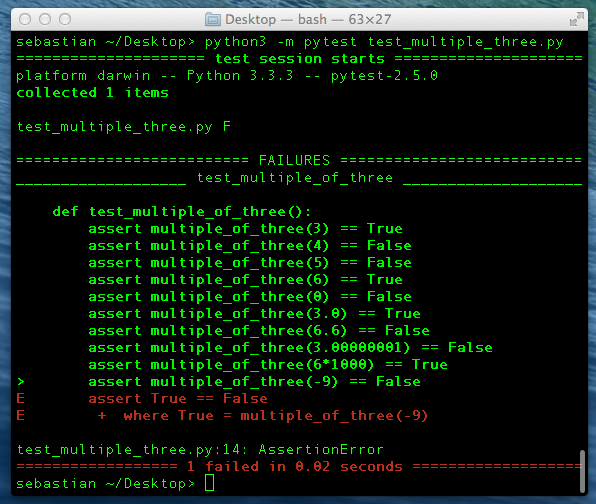

According to the unit test report, we face another problem here: Our code
considers 3 as a factor of -9 (negative 9). For the sake of this example,
let's assume that we don't want this to happen: We'd like to consider only
positive numbers to be multiples of 3. In order to account for those cases, we
need to make another small modification to our code by changing `!=0` to `>0`
in the if-statement.  
  
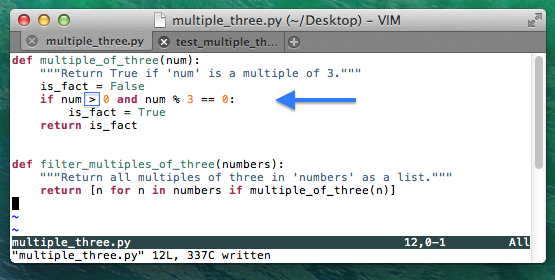

After running the _py.test_ utility again, we are certain that our code can
also handle negative numbers correctly now. And once we are satisfied with the
general behavior of our current code, we can move on to testing the next
function "filter_multiples_of_three", which depends on the correctness of
"multiple_of_three".

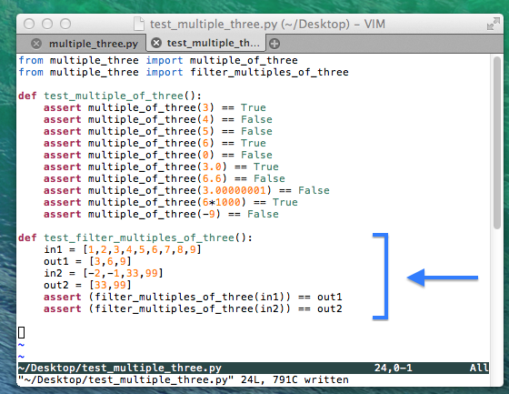
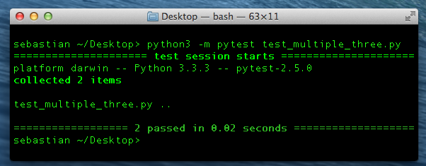

This time, our test seems to be "bug"-free, and we are confident that it can
handle all the scenarios we could currently think of. If we plan to make any
further modifications to the code in future, nothing can be more convenient to
just re-run our previous tests in order to make sure that we didn't break
anything.

If you have any questions or need more explanations, you are welcome to
provide feedback in the comment section below.

  
  

